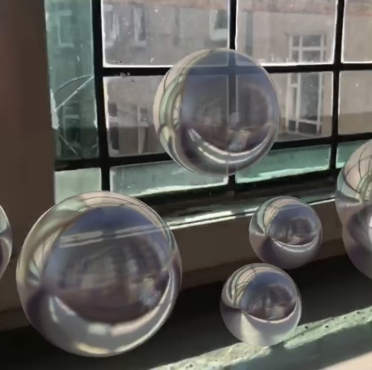

#  ARKitDemoEnvironmentTexturing

Basic demonstration of ARKit's incredible environment texturing.

```swift
let configuration = ARWorldTrackingConfiguration()
configuration.environmentTexturing = .automatic
```
</img>

Thanks to <a href="https://medium.com/@ivannesterenko/realistic-reflections-and-environment-textures-in-arkit-2-0-d8d0f1332eed">Ivan Nesterenko</a>.

